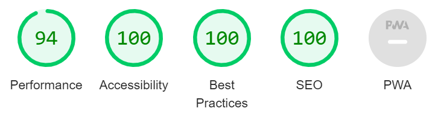

# Whippet Walks

[View the live project here](https://rob-mundy.github.io/whippet-walks/)

The Whippet Walks website is a landing page for owners of whippets & sighthound-breed dogs that are interested in meeting up for organised pack (group) walks in the Norfolk-based districts of Norwich, North Norfolk and Broadlands.

Website users can find out about the group, sign up via a form, locate upcoming events via embedded Google Maps, navigate to associated social media sites, and access training videos on a blog-style page to ensure their dogs' readiness to join.

# Features

+ ## Navigation

    + The navigation section is positioned at the top of each webpage in a consistent location.
    + It contains the group's name "Whippet Walks" in the left-hand corner, which links to the top of the home page.
    + The right-hand side displays links to the site's three pages: Home, Training Tips and Sign Up.   

+ ## The "Hero Image" header section

    + The "Hero Image" header section includes a succinct description of what the website offers: "whippet & sighthound organised pack walks".
    + It details that the group operates in Norwich, North Norfolk & Broadlands Districts.
    + It infers that the group's target dog demographic isn't limited by age or temperament, only by breed.
    + An accompanying image containing a pair of white whippets is appropriate for the color scheme and content.
    + A button detailing the words "Sign up" rounds off the section, providing an easy way for the user to navigate to the sign-up form via the embedded hyperlink.

+ ## The group ethos section

    + The ethos section provides the user three reasons to join the group, each associated with their dog's wellbeing.
    + Images of dogs enjoying themselves, mostly in packs, have been included to encourage the user to sign up for the group.
    + All images are in keeping with the website's colour scheme.   

+ ## The events section (upcoming walks)

    + The events section provides an insight into what walks are soon to take place. The event tiles have been designed to be brief but comprehensive.
    + The individual events contain location names, days, times, important details about the walk distance, dog age restrictions, terrain type, and footwear requirements.
    + On larger screens Google Maps are embedded at the bottom of the tiles, providing the user with the exact location of each walk.

+ ## The Footer

    + The Footer features a "Contact" section that encourages users to get in touch via a ficticious telephone number and/or email address.
    + As an alternative means of contact, the footer also includes five icons that serve as links to the various social media sites where the group *could* host content, arranged in order of popularity: Facebook, YouTube, Instagram, TikTok, and Twitter.  
    + For consistency, the background and font colours mimic the header to bookend the page.

+ # The Training page

    + This page aims to provide related training content that would be useful for users to view before attending their first pack walk event.  
    + It has an unfussy, blog-like format featuring articles containing brief paragraphs of supporting text along with embedded YouTube videos by Zak George's Dog Training Revolution. The stark design helps to improve the page's performance, which contains several videos that can be slow to load.
    + An additional navigation sidebar taking the form of an aside guides users to all of the videos on the page via clickable hyperlinks within the text and thumbnail images. There are only 4 videos at present to demonstrate what the page would look like, but a more thoroughly designed site would ideally contain a sticky, scrollable nav sidebar with lots of content.  

+ # The Sign Up page

    + The sign-up page's purpose is to allow users to easily sign up for the Whippet Walk group in their local area.
    + The page is easily found via the main navigation bar within the header or via a "Sign Up >" link in the hero section of the homepage.  
    + The page contains an evocative hero image of a whippet looking out over a pastoral scene, which aims to entice the user to sign up. The chosen image is consistent with the website's colour scheme.
    + The form collects the user's first name, last name, email address, and password (between 8 and 20 characters, and containing a placeholder).  It also requires the selection of the user's primary location via a radio button.
    + The form captures and submits the information in the desired manner (see the testing section for evidence).

# UX Design

+ ## Color Palette

    + A suitable color palette was generated via colormind.io's AI tool, chosen for its calming, natural tones:

        

    + A selection of darker gradients based around FJORD - 405E63 were then selected from mycolor.space to improve the contrast:

        
        

+ ## Fonts

    + The font used for the company name and subsequent h1 and h2 headings, EB Garamond, has been chosen for its organic structure, fitting for a website about animals and the outdoors. 

    + Complimentary font Poppins has been chosen for use in sub-headings and paragraphs for its simplistic style that improves readability.

+ ## Media Queries

    + The website was designed with a desktop first approach.
    + Media queries have been emlpoyed to re-organise the site's dividing sections on smaller screens such as tablets and mobiles.  

# Testing

+ I have tested that the entire site works as expected across several commonly used browsers: Chrome (desktop), Edge, Firefox, and Chrome (Android).  I do not have access to an Apple device to check the site's compatibility with the Safari browser.
+ The website has been tested in Chrome's DevTools. I can confirm it is responsive, performs well, and functions on standard screen sizes down to the "Mobile S - 320px" setting.
+ The navigation section, header, footer, headings, and subheadings are all easily legible and easy to understand.
+ The submission receipt below demonstrates that the form works as expected:

    

+ I have tested the README.md file with the [MD Reader](https://chrome.google.com/webstore/detail/md-reader/medapdbncneneejhbgcjceippjlfkmkg) extension for Chrome.

# Bugs

+ There are no outstanding bugs.

# Validator Testing

+ ## HTML

    + All pages passed through the official W3C Validator without errors.

+ ## CSS

    + All pages passed through the official W3C Jigsaw Validator without errors.

+ ## Accessibility 

    + All pages achieved the maximum Dev Tools Lighthouse accessibility score of 100 on desktop and mobile, demonstrating that the chosen colours and fonts are easily legible.
    
        Desktop:
      
        Mobile:  
    

# Deployment

## Github Pages

The site was deployed to Github Pages via the following process:

+ Navigate to settings from within Whippet Walks Github project
+ Select Pages from the Code and automation section
+ Under Build and deployment, select the source as "Deploy from a branch", then select "main" and "/(root)" from the Branch drop-down menus
+ A link to the live site is then made available upon page refresh

# Credits

## Content

+ All font icons are from [fontawesome.com](https://fontawesome.com/).
+ The idea for the sign up button on the home page was sourced from [stackoverflow.com](https://stackoverflow.com/questions/2906582/how-do-i-create-an-html-button-that-acts-like-a-link)

## Media

+ The home page hero image was sourced from [depositphotos.com](https://depositphotos.com/223407470/stock-photo-two-white-whippets-playing-outdoor.html).
+ The three group ethos section images were also sourced from depositphotos.com [here](https://depositphotos.com/6534897/stock-photo-whippet-dog-and-frisbee.html), [here](https://depositphotos.com/29852595/stock-photo-group-dog.html), and [here](https://depositphotos.com/223407512/stock-photo-two-white-whippets-playing-outdoor.html).
+ The sign-up page background image was sourced from [depositphotos.com](https://depositphotos.com/156531312/stock-photo-whippet-dog-portrait-in-nature.html).
+ The embedded YouTube videos on the tips page are courtesy of [Zak George’s Dog Training Revolution](https://www.youtube.com/c/zakgeorge). 
+ The four thumbnails within the sidebar of the tips page are all screen grabs of the embedded videos that were edited via the Windows Snipping tool.
+ The three maps within the events section of the home page were embedded via GoogleMaps using the following process:
    + Enter corresponding place name into the search bar and select an appropriate location
    + Click "Share" and then select "Embed a map"
    + Highlight the iframe link or click "COPY HTML" and add it to the project

All pictures were cropped to suitable sizes in MSPaint: 16x9 for long images, square for any that were destined to fit within a circular container.  Their resolutions were then reduced, and finally, the files were converted to webp format in [ezgif.com](https://ezgif.com/jpg-to-webp) to improve loading times.