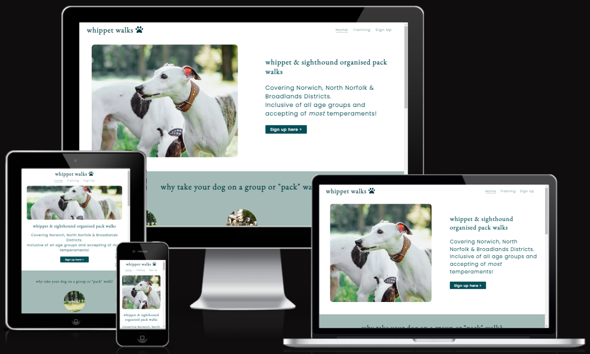

# Whippet Walks

[View the live project here](https://rob-mundy.github.io/whippet-walks/)

The Whippet Walks website is a landing page for owners of whippets and sighthound-breed dogs that are interested in meeting up for organised group or "pack" walks in the Norfolk-based districts of Norwich, North Norfolk and Broadlands.

Website users will be able to find out about the group, sign up via a form that is linked via the home page or nav menu, locate the events via embedded Google Maps, link to associated social media sites, and access training videos on a blog-style tips page to ensure their dogs' readiness to join.

# Features

+ ## Navigation

    + Found at the top of each of the website's pages in a consistent location.

    + Contains the group's name "Whippet Walks" in the left-hand corner that links to the top of the home page.

    + The right-hand side displays links to the site's three pages: Home, Training Tips and Sign Up.   

+ ## The "Hero Image" header section

    + The "Hero Image" header section includes a concise description of what the group is  

+ ## The group ethos section

+ ## The events section (upcoming walks)

+ ## The Footer

    + The Footer features a "Contact" section that encourages users to get in touch via telephone and/or email.

    + As an alternative means of contact, the footer also includes five icons that serve as links to the various social media sites where the group *could* host content, arranged in order of popularity: Facebook, YouTube, Instagram, TikTok, Twitter.  

    + The background and font colours mimic that of the header to bookend the page in a consistent fashion.

+ # The Training Tips page

    + This page concerns itself with one goal which is to provide related training content that would be sueful to users prior to attending their first pack walk event.  

    + It has a unfussy, blog-like format that is based around individual articles containing a brief paragraph of supporting text along with embedded YouTube videos by Zak George's Dog Training Revolution. The stark design was chosen to improve the page's performance given that it contains many videos that can be slow to load.

    + An additional navigation sidebar taking the form of an aside guides users to all of the videos on the page via clickable hyperlinks within both the text and videos. There are only 4 videos at present to demonstrate what the page would look like, but a more thoroughly designed site would ideally contain a sticky, scrollable nav sidebar with lots of content.  

    + The header and footer are consistent with the home page.

+ # The Sign Up page

    + The sign up page's purpose is to allow users to easily sign up to the Whippet Walk group in their local area.

    + The page is easily found via either the main navigation bar within the header or via a "Sign Up >" link in the hero section of the homepage.  

    + The page contains an evocative hero image of a whippet looking out over beautiful countryside, which is designed to entice the user to sign up.  The image is consistent with the website's colour scheme.

    + The form collects the user's first name, last name, email address, and password (between 8 and 20 characters).  It also requires the selection of the user's primary location via a radio button.

    + The header and footer are consistent with the homepage. 

    + The form captures and submits the information in the desired manner (see testing section for evidence).

# UX Design

+ ## Color Palette

+ ## Fonts

    + The font used for the company name and subsequent h1 and h2 headings, EB Garamond, has been chosen for its organic structure that is fitting for a website about animals and the outdoors. 

    + Complimentary font Poppins has been chosen for use in sub-headings and paragraphs for its simplistic style that improves readability.

+ ## Media Queries

# Testing

+ I have tested that the entire site works as expected across a number of commonly used browsers: Chrome (desktop), Edge, Firefox, Chrome (Android).  I do not have access to an Apple device in order to check its compatability with the Safari browser.

+ The website has been tested in Chrome's DevTools. I can confirm it is responsive, performs well, and functions on standard screen sizes down to the "Mobile S - 320px" setting.

+ The navigation section, header, footer, headings, and subheadings are all easily legible and easy to understand.

+ The submission receipt below demonstrates that the form works as expected:

    

# Bugs

# Validator Testing

+ ## HTML

    + All pages passed through the offical W3C Validator without errors.

+ ## CSS

    + All pages passed through the offical W3C Jigsaw Validator without errors.

+ ## Accessibility 

    + All pages achieved the maximum Dev Tools Lighthouse accessibility score of 100 on desktop and mobile, demonstrating that the chosen colours and fonts are easily legible.
    
        Desktop:
      
        Mobile:  
    

# Deployment

## Github Pages

The site has been deployed to Github Pages via the following process:

+ Navigate to settings from within Whippet Walks Github project

+ Select Pages from the Code and automation section

+ Under Build and deployment, select the source as "Deploy from a branch", then select "main" and "/(root)" from the Branch drop-down menus

+ A link to the live site is then made available upon page refresh

# Credits

## Content

## Media

+ The home page hero image was sourced from [depositphotos.com](https://depositphotos.com/223407470/stock-photo-two-white-whippets-playing-outdoor.html).

+ The three group ethos section images were also sourced from depositphotos.com [here](https://depositphotos.com/6534897/stock-photo-whippet-dog-and-frisbee.html), [here](https://depositphotos.com/29852595/stock-photo-group-dog.html), and [here](https://depositphotos.com/223407512/stock-photo-two-white-whippets-playing-outdoor.html).

+ The sign up page background image was sourced from [depositphotos.com](https://depositphotos.com/156531312/stock-photo-whippet-dog-portrait-in-nature.html).

+ The embedded YouTube videos on the tips page are all courtesy of [Zak George’s Dog Training Revolution](https://www.youtube.com/c/zakgeorge). 

+ The four thumbnails within the sidebar of the tips page are all screen-grabs of the embedded videos that were edited via the Windows Snipping tool.

+ The three maps within the events section of the home page were embedded via GoogleMaps using the following process:

    + Enter place name into search bar and select appropriate location

    + Click "Share" and then select "Embed a map"

    + Highlight the iframe link or click "COPY HTML" and add to project

All pictures were cropped to suitable sizes in MSPaint: 16x9 for long images, square for any that were destined to fit within a circular container.  Their resolutions were then reduced, and finally the files were converted to webp format in [ezgif.com](https://ezgif.com/jpg-to-webp) to improve loading times.